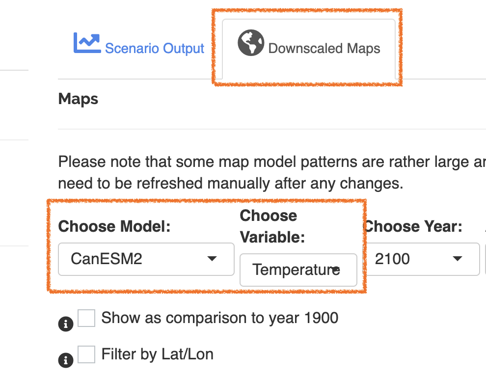
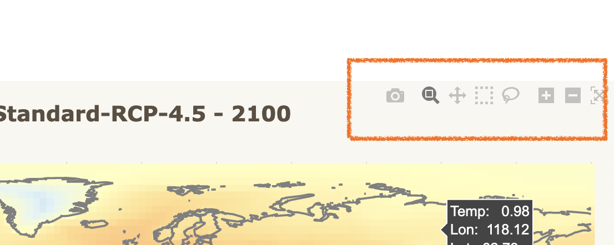
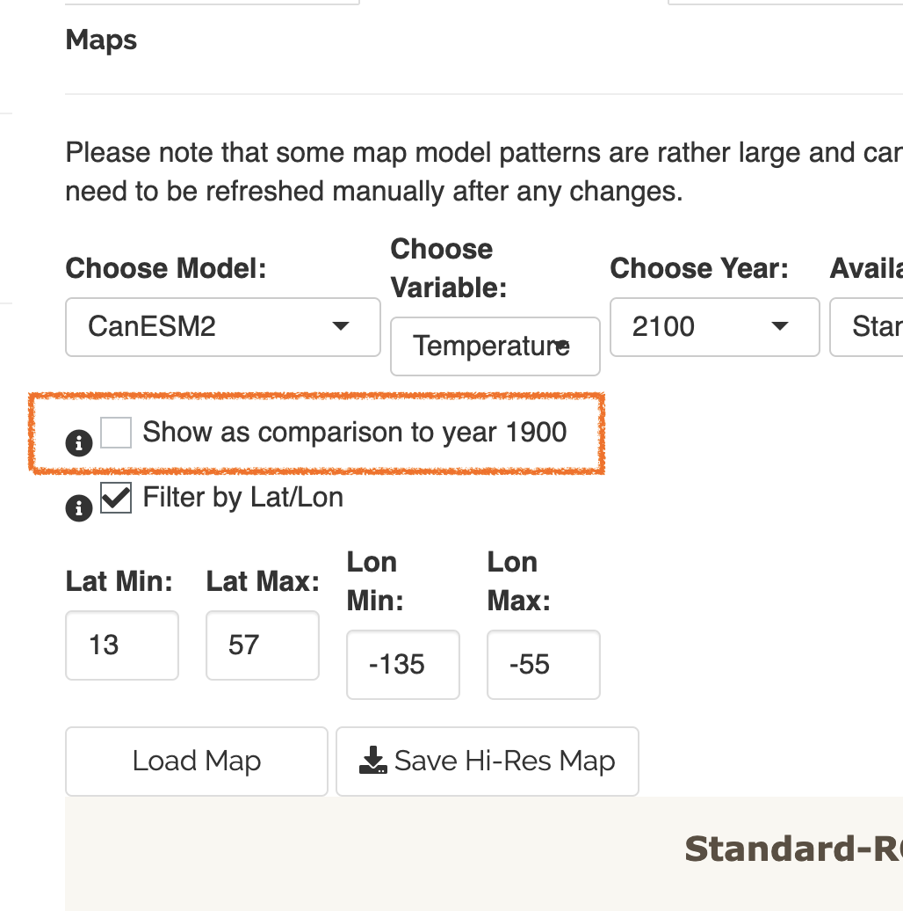
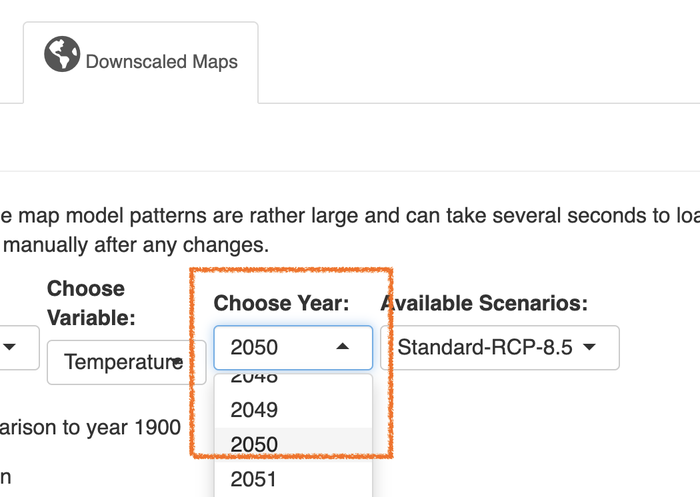
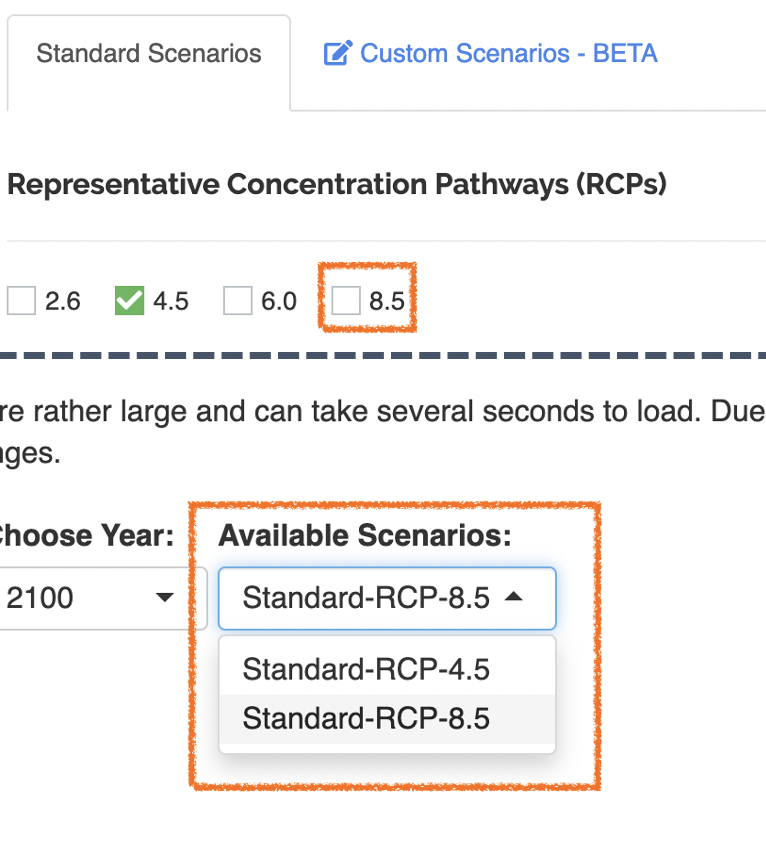
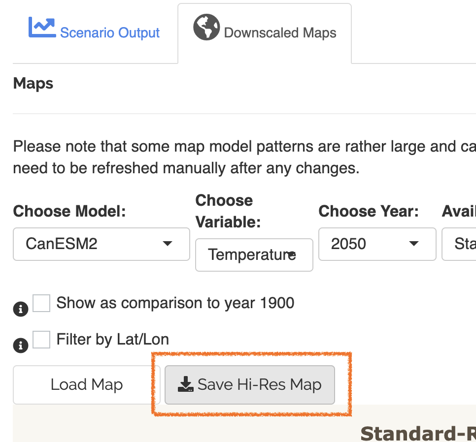

```{r setup, include=FALSE}
knitr::opts_chunk$set(echo = TRUE)
```

## Introduction
The Hector user interface was built to extend Hector, a simple, fast running global climate carbon-cycle mode into a web based interactive application. This vignette outlines the basics for interacting with the Hector user interface and includes a tutorial on how to use the Hector user interface to answer a simple science question: *What is the projected temperature change over time for a specific region?* The tools and features in this package will be able to show you the projected change in average temperature for a specific region compared to 1900 temperatures.

To run this vignette, you will need to access the `hectorui` online application at https://jgcri.shinyapps.io/HectorUI/ or install and setup the package locally.

## Setup
Simply access the application here:  https://jgcri.shinyapps.io/HectorUI/.  To access the code or contribute, clone or fork hectorui here: https://github.com/JGCRI/hectorui.

## Interface Guide
Once you have the web page loaded or set up the package locally, you will see the application home page, which contains some background information on Hector, links to code and other resources, and information on how to cite this application. There are two main sections to the application: ‘System Information’ and ‘Run Scenario’ located on the Navigation bar at the top. Within each section are subsections that access information and functionality.

The main interface is also divided into two sections: a left-hand control panel that contains preconfigured scenarios and user adjustable model parameters, and the main output panel on the right for viewing model outputs. Hector is run through “scenarios”, which are a set of emissions and model parameters that drive the model. Built into the package are four Representative Concentration Pathways (RCP) which are greenhouse gas concentration (not emissions) trajectories adopted by the IPCC. The default scenario, RCP 4.5, will be “checked” and you should see the Global Mean Temperature graph in the output section. Each scenario loaded creates a new, unique Hector core object with those parameters and emissions.


### Scenarios 
Scenarios are the main source of input for Hector. They contain emissions and parameters calibrated to represent different RCP scenarios. The default selected RCP 4.5 scenario represents a “middle of the road” projection for emissions and global mitigation. To add additional scenarios for comparison, you can check any combination of the 4 RCP scenarios and they will be represented as their own series in the output graphs. Try checking the 8.5 scenario. You should see a new series appear in the Global Temperature graph where the temperature rises faster than the 4.5 scenario. The 8.5 scenario represents somewhat of a “worst case” scenario. To view projections of other outputs choose some more variables (up to 4) in the graphs section and you should see additional graphs representing Hector’s projections of those outputs.

### Parameters
To further configure Hector, you can adjust the input parameters manually in the left hand nav or choose a global climate model to emulate and it will load up parameters that are calibrated to emulate that model. Try choosing one of the models and note how the input parameters change and the graphs are automatically updated to reflect Hector’s projection being run using those parameters.  At any point you can also manually adjust any of the input parameters and set them by clicking the “Set Parameters” button. 

### Custom Scenarios
The Hector user interface allows advanced users to customize their own scenarios via the “Custom Scenarios” tab in the left hand nav. The custom scenarios use the RCP scenarios as a starting point and allow you to edit the complete time series of emissions. To create a custom scenario you will need to download the excel scenario template file that you want to use as a starting point, edit the emissions within the file, and reupload it to the system. Once done, you will see your scenario’s output in the graphs on the right, just like one of the preconfigured scenarios.

### Other Outputs
In addition to the main graph interface, Hector also has a few other outputs. On the graph tab, there is a “Download Raw Data” button which will download the complete time series output for all of the scenarios and output variables that you have chosen. Clicking the “Downscaled Maps” tab in the output section allows you to view cell based global data for temperature and precipitation using pattern generation techniques. This is discussed more in the tutorial.

## Tutorial Scenario: Determining the projected temperature change over time for a specific region

Tutorial Step 1: Getting Started | Example
--------------- | -------
To begin the tutorial, make sure you are in the “Explore Hector” tab and click the model emulation dropdown and choose one of the models available, or leave it as Hector default. The different models contain unique input parameters that drive the Hector model’s output. The models also have various degree resolutions for the downscaled maps we will be viewing. For the purposes of this experiment you may choose whichever you like. | {width=250px}

Tutorial Step 2: Setting Map Parameters | Example
--------------- | -------
Click the ‘Downscaled Maps’ tab in the output section on the right and match the model dropdown there to the choice you made in the model parameters dropdown. This tells the system which model to emulate when doing the downscaling. In general, its best to match the models for the most accurate output. Set the Variable to temperature and the Year to 2020 and leave the Scenario as RCP 4.5 (the list of available scenarios corresponds to whichever RCP’s you have selected as well as any custom scenarios you created). Now click ‘Load Map’.  | {width=250px} 

Tutorial Step 3: Choose Location | Example
--------------- | -------
You should see a global map of average temperature per unit of resolution (varies based on which model you chose). Now choose a point of origin, it could be the location of your home, school, work, or anywhere you want use as a point of references. Use one of the map zoom tools in the upper right hand corner to zoom in a little bit to your point of origin and hover over some of the cells. | {width=250px}

Tutorial Step 4: Rescaling the Map | Example
--------------- | -------
To get a better view of temperature change in the region, rescale the map to your coordinates by clicking the ‘Filter by lat/lon’ check box. Enter a set of coordinates that corresponds to a box around your point of origin. If you aren’t sure, you can always use the maps x/y axis and/or the hover data to examine coordinates. In this example, we are using the system default coordinates which zooms into the United States region. Click ‘Load Map’ again. You should see a much broader range of temperature gradient for the region now, giving you better regional detail. The numbers didn’t change; the temperature legend has been rescaled based on your coordinates. It is now using the regional data within your specified bounding box to build the legend’s max/min values. Note the pattern of temperature changes in the region, it will be of use later. | {width=250px}

Tutorial Step 5: Historical Comparison | Example
--------------- | -------
This map is useful, but without more context it is difficult to determine how much the temperature changed over time. This can be accomplished by clicking the ‘Show as comparison to year 1900’ checkbox and then clicking ‘Load Map’ again. You should now see a much smaller range of numbers in the legend. The values represent the delta in temperature by comparing the values at the year 1900 to the values of the chosen year, in this case 2020. Hover over some of the cells and note the change in temperature in the region. Note the gradient pattern. In the US for example, some of the colder areas are getting hotter faster then the warmer regions of the country. | {width=250px} 

Tutorial Step 6: Future Projections | Example
--------------- | -------
Next, let’s do some future projections. Change the year to 2050 and click ‘Load Map’ again. Note the larger values in the legend, representing greater delta in temperature. We are viewing a middle of the road scenario RCP 4.5 which represents the world doing a moderate amount of mitigation. What about the worst case scenario, RCP 8.5? | {width=250px}

Tutorial Step 7: Adding More Scenarios | Example
--------------- | -------
Click the check box for the 8.5 scenario in the upper left. A new, separate Hector core has been initialized with the 8.5 parameters and it is now available for selection in the map section’s ‘Available Scenarios’ dropdown box. Choose the Standard 8.5 in the drop down and click ‘Load Map’ again. Note the greater range of temperatures reflecting further warming. Hover over your region and view the local temperature. The temperatures should be a bit higher than the RCP 4.5 scenario. This is because the RCP 8.5 scenario accounts for less mitigation of emissions and climate control. | {width=250px}

Tutorial Step 8: Future Projections (2100) | Example
--------------- | -------
Lastly, let’s project all the way to 2100, the maximum available year for Hector’s projections. Choose 2100 in the Year dropdown and click ‘Load Map’ again. Note the further expansion of temperature change. If you are still viewing the 8.5 scenario, try viewing the 4.5 also and note the differences. In the case of the US, the difference is dramatic, on the order of several degrees Celsius. | {width=250px}

Tutorial Step 9: Further Exploration | Example
--------------- | -------
Feel free to explore further the maps section by adjusting the model emulation, the model parameters, adding the 2.6 or 6.0 scenarios, or any of the other variables. A high resolution version of your map may be downloaded by clicking the “Save Hi-Res Map” button. | {width=250px} 

## Conclusion
This concludes the tutorial and interface guide. After completing this, you should have a basic understanding of how the interface works, how the different pieces interact, and how to create meaningful output. For more detailed information on Hector, check the “About” section for links to the formal model description paper, the source code for Hector, and other related links and information. Feel free to examine and explore as much as you want.
