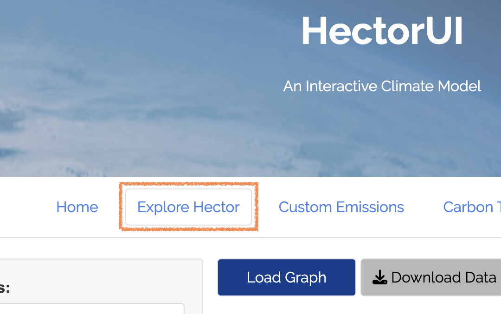
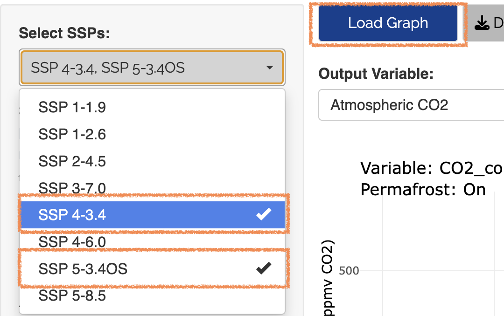

```{r setup, include=FALSE}
knitr::opts_chunk$set(echo = TRUE)
```

## Introduction
The Hector user interface was built to extend Hector, a simple, fast running global climate carbon-cycle mode into a web based interactive application. This vignette outlines the basics for interacting with the Hector user interface and includes a tutorial on how to use the Hector user interface to answer a simple science question: *How would we get to 3.4 W/m2 radiative forcing by 2100 in SSP 5?* The tools and features in this package will be able to show you the projected change in average temperature for a specific region compared to 1900 temperatures.

To run this vignette, you will need to access the `hectorui` online application at https://jgcri.shinyapps.io/HectorUI/ or install and setup the package locally.

## Setup
Simply access the application here:  https://jgcri.shinyapps.io/HectorUI/.  To access the code or contribute, clone or fork hectorui here: https://github.com/JGCRI/hectorui.

## Interface Guide
Once you have the web page loaded or set up the package locally, you will see the application home page, which contains some background information on Hector, links to code and other resources, and information on how to cite this application. There are two main sections to the application: ‘System Information’ and ‘Run Scenario’ located on the Navigation bar at the top. Within each section are subsections that access information and functionality.

The main interface is also divided into two sections: a left-hand control panel that contains preconfigured scenarios and user adjustable model parameters, and the main output panel on the right for viewing model outputs. Hector is run through “scenarios”, which are a set of emissions and model parameters that drive the model. Built into the package are eight Shared Socioeconomic Pathways (SSPs), representing different "pathways" the world could take, adopted by the IPCC. The default scenario, SSP 4-3.4, will be “checked” and you should see the Atmospheric CO2 graph in the output section. Each scenario loaded creates a new, unique Hector core object with those parameters and emissions.


### Scenarios 
Scenarios are the main source of input for Hector. They contain emissions and parameters calibrated to represent different SSP scenarios. The default selected RCP 4-3.4 scenario represents a “middle of the road” projection for emissions and global mitigation with a goal radiative forcing of 3.4 W/m2 at the end of 2100. To add additional scenarios for comparison, you can check any combination of the eight SSP scenarios and they will be represented as their own series in the output graphs. Try also checking the SSP 5-3.4OS scenario and clicking "Load Graphs". You should see a new Atmospheric CO2 graph with two lines. The 5-3.4OS scenario represents somewhat of a “worst case” scenario, where global fossil fuel emissions continue to increase. The SSP 4-3.4 line shows global average CO2 concentrations stay below 600 ppmv CO2 while SSP 5-3.4OS goes well above 1000 ppmv CO2.

### Parameters
To further configure Hector, you can adjust the input parameters manually in the left hand nav. At any point you can also manually adjust any of the input parameters and set them by clicking the “Load Graphs” button. 

### Custom Scenarios
The Hector user interface allows advanced users to customize their own scenarios via the “Custom Scenarios” tab in the left hand nav. The custom scenarios use the SSP scenarios as a starting point and allow you to edit the complete time series of emissions. To create a custom scenario you will need to download the excel scenario template file that you want to use as a starting point, edit the emissions within the file, and reupload it to the system. Once done, click "Create Scenario" and you will see your scenario’s output in the graphs on the right, just like one of the preconfigured scenarios.

### Other Outputs
In addition to the main graph interface, Hector also has a few other outputs. On the graph tab, there is a “Download Raw Data” button which will download the complete time series output for all of the scenarios and output variables that you have chosen. Clicking the “Downscaled Maps” tab in the output section allows you to view cell based global data for temperature and precipitation using pattern generation techniques. This is discussed more in the tutorial.

## Tutorial Scenario: Determining the projected temperature change over time for a specific region

Tutorial Step 1: Getting Started | Example
--------------- | -------
To begin the tutorial, make sure you are in the “Explore Hector” tab. | {width=250px}

Tutorial Step 2: Setting SSPs | Example
--------------- | -------
Click the "Select SSPs" dropdown  and choose 'SSP 4-3.4' and 'SSP 5-3.4OS'.  Now click "Load Graph". You should see a graph of CO2 concentrations and two lines - one for each SSP you chose. We see the SSP 5-3.4 exceeds SSP4-3.4 in global average CO2 concentrations around 2020 but begins to decline around 2040. | {width=250px} 

Tutorial Step 3: Choose Output Variable | Example
--------------- | -------
Next, use the "Output Variable" dropdown to choose 'RF - Total', click "Load Graphs". Here we see that both SSPs end around 3.4 W/m2 at the end of 2100. Let's look at another output variables to see how emissions change over time. | {width=250px}

Tutorial Step 4: Rescaling the Map | Example
--------------- | -------
Use the "Output Variable" dropdown menu again to select 'FFI Emissions' and click "Load Graph". Here we see a sharp decline in fossil fuel emissions in the year 2040, which is likely contributing to the radiative forcing mitigation we saw in Step 3. | {width=250px}

## Conclusion
This concludes the tutorial and interface guide. After completing this, you should have a basic understanding of how the interface works, how the different pieces interact, and how to create meaningful output. For more detailed information on Hector, check the “About” section for links to the formal model description paper, the source code for Hector, and other related links and information. Feel free to examine and explore as much as you want.
